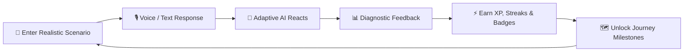
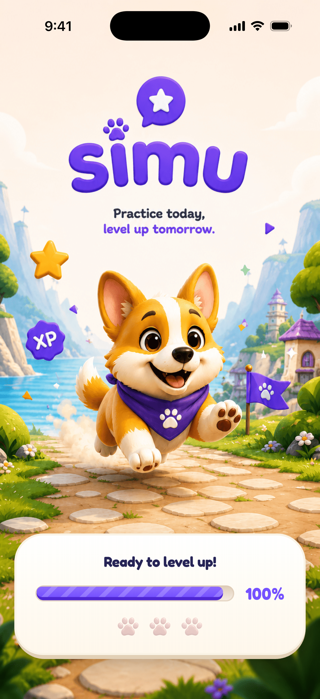
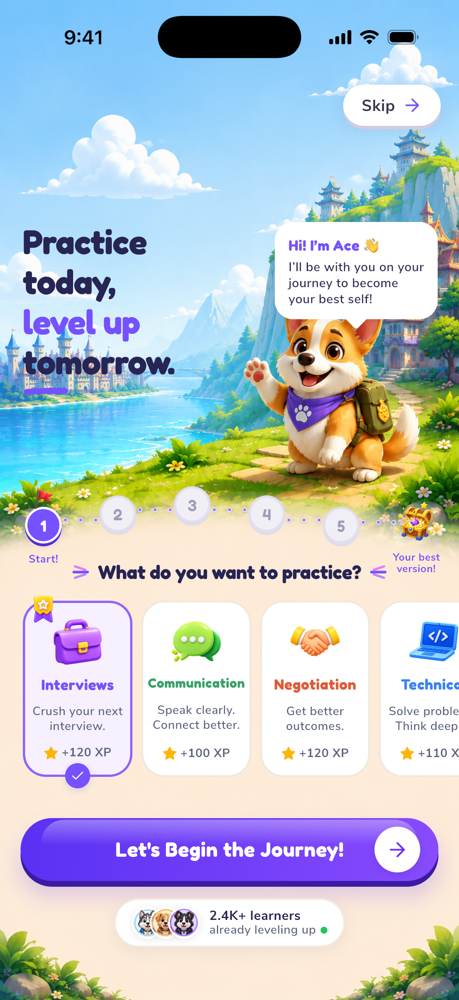
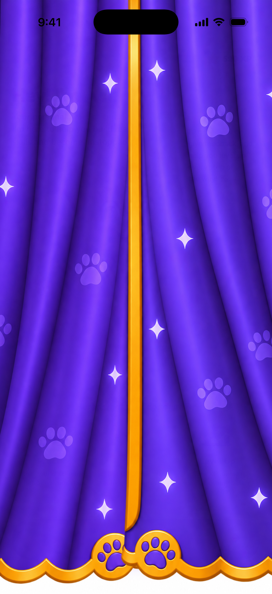
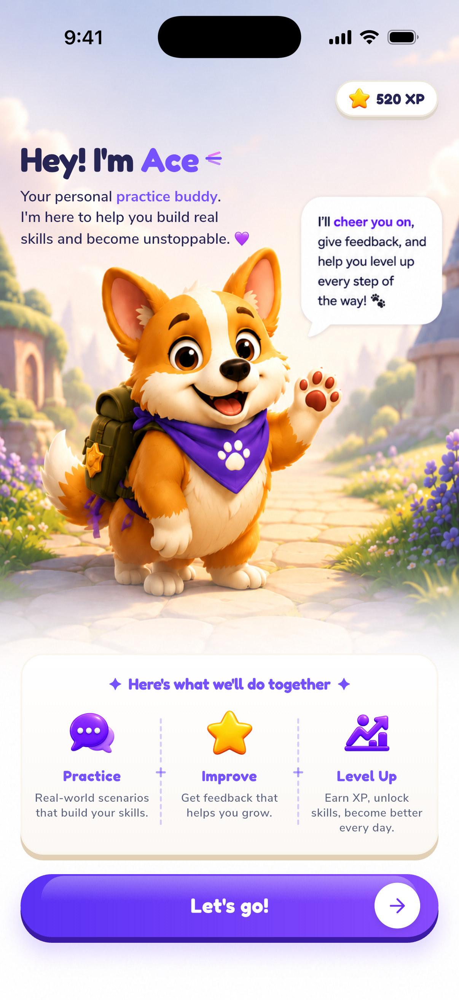
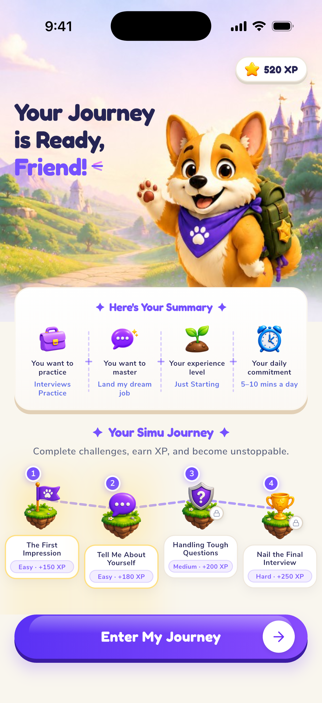
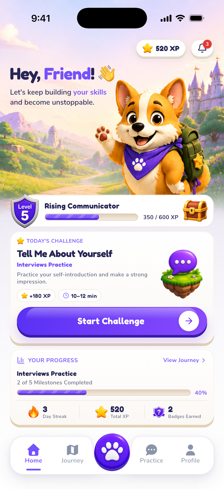

<div align="center">

  <!-- Logo / Hero Badge -->
  

  # 🦊 Simu — Interactive Skill Practice & AI Simulation Platform

  <p align="center">
    <strong>Enter realistic high-stakes scenarios, interact with adaptive AI, and master critical communication skills through tactile gamification.</strong>
  </p>

  <p align="center">
    <a href="#-key-features">Key Features</a> •
    <a href="#-app-showcase">Showcase</a> •
    <a href="#-architecture--engineering">Architecture</a> •
    <a href="#-design-system">Design System</a> •
    <a href="#-getting-started">Getting Started</a> •
    <a href="#-project-structure">Structure</a>
  </p>

  <!-- Badges -->
  <p align="center">
    
    
    
    
    
    
  </p>

</div>

---

## 🌟 Overview

**Simu** is an interactive, game-like AI skill-practice platform built from the ground up with **Flutter**. 

Traditional e-learning platforms rely on passive reading, multiple-choice quizzes, or pre-recorded videos. But real-world mastery—whether negotiating a six-figure salary, delivering tough executive feedback, de-escalating team conflict, or nailing a technical design review—cannot be learned from a video. **You have to enter the room, feel the pressure, speak, and adapt to live human reactions.**

Simu bridges this gap by immersing users into realistic conversational simulations guided by **Ace**, an expressive Corgi companion and AI coach.



---

## ✨ Key Features

### 🎙️ 1. Multi-Modal Interactive Simulation Engine
- **Realistic Scenario Briefings:** Detailed roleplay context, stakeholder personalities, objectives, and pressure conditions.
- **Dynamic Turn-by-Turn Dialogue:** Speak via live voice input (with audio waveform recording states) or natural text input.
- **Adaptive AI Reactions:** The scenario partner dynamically shifts mood, posture, and tone based on your rhetoric and empathy.
- **In-Flight Coaching & Hints:** Real-time hints from Ace the Corgi when you're stuck, with pressure timers and live composure tracking.

### 📊 2. Deep Diagnostic Performance Feedback
- **Holistic Evaluation:** Overall letter grade (`S`, `A`, `B`, `C`) with multi-dimensional scoring: Clarity, Persuasion, Empathy, and Decisiveness.
- **Granular XP & Reward Breakdown:** Transparent XP calculations, streak bonuses, and milestone rewards.
- **Key Strengths & Growth Areas:** Actionable, bulleted insights pointing out exact conversation moments that worked or faltered.
- **Recommended Follow-up Drills:** One-tap targeted micro-drills to immediately shore up identified weak spots.

### 🐕 3. Ace the Mascot & Intelligent Coach
- **7+ Expressive Reaction States:** `idle`, `happy`, `encouraging`, `thinking`, `celebrating`, `speaking`, and `disappointed`.
- **Pluggable Renderer Architecture:** Built with an abstracted `MascotRenderer` contract, allowing instant hot-swapping between procedural vector renders, PNG assets, Lottie, or Rive animations without changing screen code.

### 📚 4. Multi-Category Practice Library
- **Diverse Practice Tracks:**
  - 💼 **Job & Executive Interviews:** Behavioral, System Design, Stakeholder Presentation.
  - 🤝 **High-Stakes Negotiation:** Salary offers, Vendor contracts, Scope reduction.
  - ⚡ **Critical Communication:** Cross-team alignment, delivering constructive criticism, crisis briefing.
  - 🛡️ **Conflict Resolution:** De-escalating heated disagreements, mediating peer friction.
- **Smart Filtering & Discovery:** Search by difficulty tier (Beginner, Intermediate, Advanced), expected duration, and XP bounty.

### 🎮 5. Tactile Gamification & Progression
- **Interactive Journey Path:** Visual winding progression map with milestone checkpoints, locked gates, and boss challenges.
- **Streaks & Daily Cadence:** Dynamic streak flame counters, customizable daily practice goals, and smart notification hooks.
- **Trophy Cabinet & Achievements:** Unlockable achievement badges with progress percentages, rarity tiers, and celebration modals.

### 🎨 6. Premium Tactile 3D Design System
- **Optimistic Light Visual Language:** Warm whites, cream pastels, vivid purples (`#6C5CE7`), mint (`#10B981`), amber, and coral.
- **Physics-Inspired Tactile Buttons:** Custom 3D action buttons with extruded bottom bevels and tactile spring-press animations.
- **Expressive Typography Pairing:** Distinctive **Fredoka** display typography paired with crystal-clear **Nunito Sans** body copy.

---

## 📱 App Showcase

> *Screenshots captured directly from the live Flutter application on iOS (iPhone 17).*

| 01. Brand Splash & Entrance | 02. Interactive Goal Selection | 03. Velvet Curtain Transition |
|:---:|:---:|:---:|
|  |  |  |
| *Full-screen landscape illustration with Ace & animated loader* | *Step 1 calibration with tactile 3D cards & XP bounties* | *Physics-driven purple velvet curtain reveal animation* |

<br />

| 04. Meet Ace (AI Companion) | 05. Personalized Journey Roadmap | 06. Home Hub & Daily Quests |
|:---:|:---:|:---:|
|  |  |  |
| *Ace introduction with speech bubble & 3-step value pillars* | *Interactive 3D floating island checkpoints & XP summary* | *Level badge, today's challenge, streak & paw navigation* |

---

## 🏛️ Architecture & Engineering

Simu is architected following strict **Clean Architecture** principles with a **Feature-First** structure to ensure high testability, scalability, and zero feature cross-coupling.

```
                  ┌─────────────────────────────────┐
                  │       Presentation Layer        │
                  │  (Pages, Widgets, Controllers)   │
                  └────────────────┬────────────────┘
                                   │ listens to / watches
                                   ▼
                  ┌─────────────────────────────────┐
                  │    State Management (Riverpod)  │
                  │     (Notifiers, AsyncValue)     │
                  └────────────────┬────────────────┘
                                   │ executes
                                   ▼
                  ┌─────────────────────────────────┐
                  │          Domain Layer           │
                  │   (Entities, Repository Interfaces)   │
                  └────────────────┬────────────────┘
                                   │ implements
                                   ▼
                  ┌─────────────────────────────────┐
                  │           Data Layer            │
                  │    (Data Sources, Repositories, DTOs)   │
                  └─────────────────────────────────┘
```

### Architectural Principles:
1. **Separation of Concerns:** UI widgets never make direct network calls or contain business logic.
2. **Immutable State:** All state objects are immutable and managed via Riverpod `Notifier` / `NotifierProvider`.
3. **Dependency Inversion:** Features depend solely on abstract repository contracts defined within their domain layer.
4. **Isolated Vertical Slices:** Features (`simulation`, `onboarding`, `practice`, `progression`) operate independently, preventing spaghetti dependencies.
5. **Reusable Design System:** All buttons, cards, badges, progress bars, and modals are centralized in `lib/design_system/`.

---

## 📂 Project Structure

```
lib/
├── app/
│   ├── app.dart                   # Root SimuApp widget
│   ├── config/                    # Environment & runtime configurations
│   ├── router/                    # go_router configuration & route definitions
│   └── theme/                     # Design tokens (Colors, Typography, Spacing, Shadows, Radii)
│
├── core/
│   ├── bootstrap/                 # Application bootstrap and pre-warming
│   ├── constants/                 # Shared app-wide constants
│   ├── errors/                    # Typed AppFailure & AppException hierarchy
│   ├── extensions/                # BuildContext, Theme, and String extensions
│   ├── logging/                   # AppLogger abstraction & console logger
│   ├── result/                    # Sealed Result<T, E> functional return type
│   └── services/                  # Abstract storage, network, and audio contracts
│
├── design_system/                 # Global UI Kit
│   ├── components/
│   │   ├── actions/               # Tactile 3D primary & secondary action buttons
│   │   ├── badges/                # Reusable pill, XP, and status badges
│   │   ├── cards/                 # Tactile selectable & game cards
│   │   ├── layout/                # SimuScaffold & SimuPageHeader
│   │   ├── mascot/                # SimuMascot (Ace) & speech bubbles
│   │   ├── progress/              # Candy-style animated progress bars
│   │   └── states/                # Loading, error, and empty feedback states
│   └── design_system.dart         # Barrel export
│
└── features/                      # Feature-First Modular Slices
    ├── auth/                      # Authentication & session entry
    ├── drills/                    # Bite-sized rapid practice drills
    ├── home/                      # Main hub, daily quests, and streak dashboard
    ├── onboarding/                # Welcome, calibration, goal selection, & Ace reveal
    ├── practice/                  # Practice catalog, categories, & scenario details
    ├── profile/                   # User profile, statistics, and customization
    ├── progression/               # Journey path, checkpoints, and achievements
    ├── results/                   # Post-simulation scorecards and analytics
    ├── settings/                  # App preferences, audio, and notification toggles
    └── simulation/                # Core turn-based AI simulation & live stage
```

---

## 🎨 Typography & Design Tokens

Simu uses a meticulously balanced typography system that pairs playfulness with high readability:

| Typeface | Role | Weights | Usage |
|:---|:---|:---|:---|
| **Fredoka** | Display & Brand | Regular, Medium, SemiBold, Bold | Hero titles, XP scores, level names, CTAs |
| **Nunito Sans** | Body & Metadata | Regular, Medium, SemiBold, Bold | Scenario briefings, dialogue, instructions, stats |

### Core Color Palette:
- 🟣 **Primary Purple (`#6C5CE7`)**: Focus actions, active highlights, brand identity.
- 🟢 **Success Mint (`#10B981`)**: Positive feedback, XP gains, completed milestones.
- 🟡 **Warning Amber (`#F59E0B`)**: Streak flames, reward chests, gold badges.
- 🔴 **Coral Accent (`#F43F5E`)**: High-stakes indicators, timers, destructive actions.
- ⚪ **Warm Canvas (`#FBFBFE`)**: Soft, eye-friendly light background surfaces.

---

## 🚀 Getting Started

### Prerequisites
- **Flutter SDK:** `>=3.3.0` (Dart `>=3.0.0`)
- **Xcode** (for iOS simulator/device) or **Android Studio** (for Android emulator/device)

### Installation

1. **Clone the repository:**
   ```bash
   git clone https://github.com/zakjnr999/simu.git
   cd simu
   ```

2. **Install Flutter dependencies:**
   ```bash
   flutter pub get
   ```

3. **Run code generation (if modifying models):**
   ```bash
   dart run build_runner build --delete-conflicting-outputs
   ```

4. **Launch the application:**
   ```bash
   flutter run
   ```

---

## 🧪 Testing & Code Quality

Simu maintains rigorous test coverage spanning unit, widget, and integration flows:

```bash
# Run the complete test suite
flutter test

# Run static analysis and lint checks
flutter analyze

# Format Dart codebase
dart format .
```

---

## 👨‍💻 Author

**Zakaria** ([@zakjnr999](https://github.com/zakjnr999))  
*Flutter & Mobile Application Engineer*

If you find this project inspiring or useful as a showcase of clean Flutter architecture and tactile design systems, please consider giving it a ⭐ on GitHub!

---

<div align="center">
  <sub>Built with ❤️ using Flutter and Riverpod. Dedicated to helping people speak with confidence.</sub>
</div>
